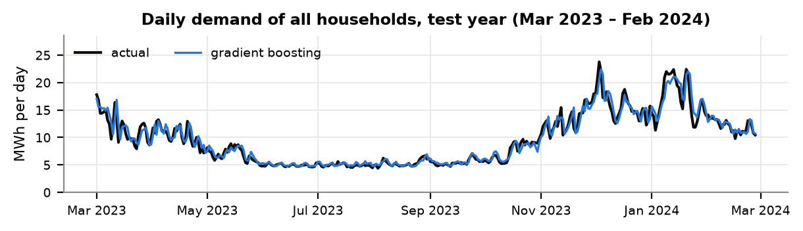
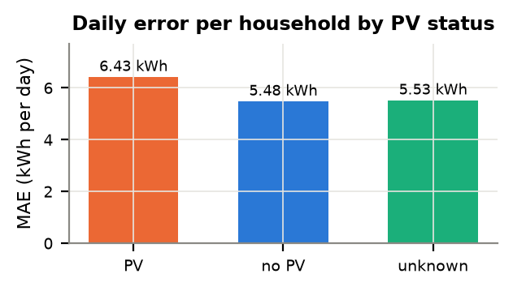
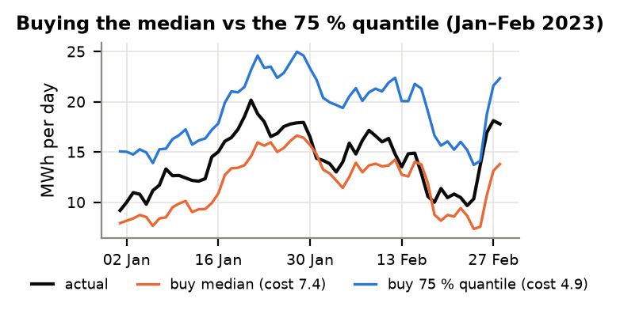

# Bringing the Heat: day-ahead demand forecasts for heat-pump homes

RWTH Energy Summer School Hackathon · Team 1 · challenge by E.ON. The one-page PDF version is [`report/summary.pdf`](report/summary.pdf).

**Task:** forecast how much electricity 375 heat-pump households will draw from the grid on the next day, so E.ON can buy the right amount on the day-ahead market.

**Result:** one gradient-boosting model for all households predicts the daily demand of all households combined with a **7.8 % mean absolute error** (R² = 0.94). Combined with a SARIMAX model, the error drops to **7.4 %**.

## Data and setup
- **Data:** 15-min grid consumption of 375 households with > 1 year of data and survey metadata (118 with PV, 99 without, 158 unknown), plus 8 hourly weather stations.
- **Cleaning:**
  - Columns are read by name, because their order differs between files.
  - Missing and impossible readings (> 40 kW) are dropped, never imputed.
  - Weather timestamps mark the *end* of the hour and are shifted to its start.
  - Sunshine for the 3 stations without a sensor is filled from the other stations and flagged.
- **Day-ahead rule:** the forecast for day D only uses data up to the end of day D−1 (yesterday's load and weather, the load one week earlier). Nothing from day D.
- **Split by time:** train before 1 March 2023, **test on the following 12 months** (12.5 M readings, including a full winter). Hyperparameters were tuned on Jan–Feb 2023, never on the test year.
- **Shared benchmark:** a common Python package (`forecast/`) scores every model on the same test rows, both for all households combined (what E.ON buys) and per household.

## Model (Level 0)
One **global gradient-boosting model** (scikit-learn, histogram-based) for all households, with 26 features:
- load of the same 15 min yesterday and one week earlier;
- yesterday's weather;
- time of day, weekday, month;
- PV flag and heat-pump optimisation visit;
- building survey answers.

The most important features (permutation importance) are yesterday's and last week's load, yesterday's mean temperature, living area and time of day.

## Results: daily demand, test year

| Model | all households: nMAE | all households: R² | per household: nMAE | per household: R² |
|---|---|---|---|---|
| **Gradient boosting** | 7.8 % | 0.942 | 21.5 % | 0.819 |
| **GBM + SARIMAX** | **7.4 %** | **0.949** | **19.1 %** | **0.847** |
| SARIMAX (daily total) | 7.4 % | 0.948 | 20.1 % | 0.809 |
| Same as yesterday | 7.9 % | 0.939 | 20.3 % | 0.806 |
| Same as last week | 16.9 % | 0.718 | 29.2 % | 0.631 |

- **nMAE** is the mean absolute error as a share of mean demand. For all households combined, 7.8 % means ≈ 750 kWh per day on an average demand of 9.6 MWh.
- **Tuning:** tuning on Jan–Feb 2023 (12 candidates) lowered the error to 7.5 %.
- **Combined vs per household:** the error is 2.5× lower for all households combined than per household. Individual heat pumps are hard to predict, but their errors largely cancel in the sum.

## PV vs no PV (Level 1)

- **PV households have ≈ 40 % higher daily errors.** Their grid draw depends on the next day's sunshine, which the model only knows from yesterday.
- **Unknown status:** these households behave like the no-PV group.

## Uncertainty and buying decision (Levels 2–3)

- **Intervals:** quantile gradient boosting gives 80 % intervals that contain 78 % of the readings (Jan–Feb 2023 validation).
- **Buying decision:** if buying too little costs **3×** more than buying too much, the optimal amount is the 75 % quantile (3 / (3 + 1)). Buying it instead of the median **cuts the daily cost by 34 %**.
- **Why the median falls short:** summed household medians are below actual demand on 56 of 59 days.

## Limitations and next steps
- **No weather forecasts in the data.** With day D's measured weather as a perfect forecast, the daily error dropped from 11.3 % to 4.2 % in an earlier experiment. A real weather forecast is the biggest lever.
- **Next steps:**
  - forecast quantiles of the *total* demand directly, because summed household quantiles over-buy;
  - PV-specific models;
  - costs from real day-ahead and intraday prices.
